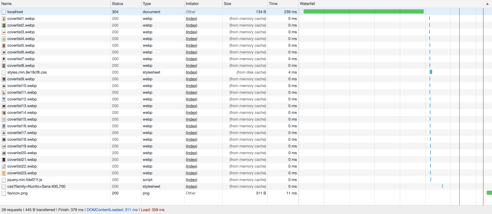

<h1 align="center">Performance Matters @cmda-minor-web · 2018-2019</h1>

<p align="center"><b>Transfering the <a href="https://github.com/Mennauu/project-1-1819" target="_blank">OBA client side web app</a> to a server side rendered application. Also, a series of optimisations have been implemented to improve the performance of the application. It's also avaiable offline.</b>
</p>

<br>

<p align="center">
  <a href="https://mennauu.github.io/web-app-from-scratch-18-19/week1">
    
  </a>
  &nbsp;&nbsp;&nbsp;
  <a href="https://mennauu.github.io/web-app-from-scratch-18-19/week2">
    
  </a>
  &nbsp;&nbsp;&nbsp;
  <a href="https://mennauu.github.io/web-app-from-scratch-18-19/week3">
    
  </a>
  &nbsp;&nbsp;&nbsp;
  <a href="https://github.com/Mennauu/web-app-from-scratch-18-19/blob/master/LICENSE">
    
  </a>
</p> 

<br>


<br>

<!-- ☝️ replace this description with a description of your own work -->
## Introduction
[ Description ]

Some resources possess an emoticon to help you understand which type of content you may find:

- 📖: Documentation or article
- 🛠: Tool or library
- 📹: Video

You can find a live demo right here: https://mennauu.github.io/performance-matters-1819/week3

<!-- Maybe a table of contents here? 📚 -->
## Table of Contents

- [Installation](#installation)
- [Interactions](#interactions)
- [Data](#data)
  - [Authentication and limit](#authentication-and-limit)
  - [Featured data](#featured-data)
  - [Retrieve](#retrieve)
  - [Cache](#cache)
- [Code structure](#code-structure)
  - [Actor diagram](#authentication-and-limit)
  - [Interaction diagram](#authentication-and-limit)
- [Checklist](#checklist)
- [Credits](#credits)
- [Sources](#sources)
  - [API](#api)
  - [Router](#router)
  - [Async and await](#async-and-await)
  - [General JavaScript](#general-javascript)
  - [Diagrams](#diagrams)
- [License](#license)

<!-- How about a section that describes how to install this project? 🤓 -->
## Installation
1. Open your terminal
2. Change the directory to a folder in which you want to place the files
```bash
cd /~path
```
3. Clone the repository (you're going to need [Git](https://www.linode.com/docs/development/version-control/how-to-install-git-on-linux-mac-and-windows/))
```bash
git clone https://github.com/Mennauu/performance-matters-1819
```
4. 

## Optimalisations

### First view
___

#### Compression
The first thing I did was add compression. Brotli compression seems to be the most efficient.
```diff
+ HTML size reduction 71,4%
+ CSS size reduction: 54,8%
+ JQUERY size reduction: 
```
<details>
  <summary>Network results based on a slow 3G network</summary>
<br>

**Without compression**
```
HTML: Size 4.2 KB | Time 2.09s
CSS: Size 3.1 KB | Time 2.27s
JQUERY: Size 247 KB | Time 8.14s

28 requests | 1326 KB transferred | Finish 15.31s | DOMContentLoaded: 12.34s | Load 13.29s
```

**With Gzip (no jQuery)**
```
HTML: Size 1.2 KB | Time 2.01s
CSS: Size 1.4 KB | Time 2.04s

27 requests | 105 KB transferred | Finish 13.40s | DOMContentLoaded: 2.06s | Load 11.38s
```

**With Brotli**
```
HTML: Size 1.0 KB | Time 2.01s
CSS: Size 1.4 KB | Time 2.03s
JQUERY: Size: 66.9 KB | Time 3.65s

28 requests | 138 KB transferred | Finish 14.41s | DOMContentLoaded: 6.18s | Load 12.39s
```
</details>

___

#### Minifying
I minified CSS and JavaScript (jQuery)

```diff
+ CSS size reduction: 17,7%
+ JQUERY size reduction: 63.4%
```
<details>
  <summary>Network results based on a slow 3G network</summary>
<br>

**Not minified**
```
CSS: Size 1.7 KB | Time 2.25s
JQUERY: Size: 66.9 KB | Time 3.65s
```

**Minified**
```
Size: 1.4 KB | Time: 2.08s
jQUERY: 24.5 KB | Time 2.78s
```
</details>

___

#### Images to WebP
Support is weak for WebP, but that doesn't mean we shouldn't use it in browsers that can actually make use of it. We can use a fallback. Browsers that don't support the picture tag, or webp files, will just ignore those lines and render the fallback image in the img tag.
```diff
+ Total images size reduction: 32%
```

```html
<picture>
  <source srcset="{{cover_image}}" type="image/webp">
  <source srcset="{{cover_image_fallback}}" type="image/jpeg">
  
</picture>
```

<details>
  <summary>Network results based on a slow 3G network</summary>
<br>

**Jpeg**


**WebP**


</details>

___

### Repeat view

#### Unique hash digits
[Staticify](https://www.npmjs.com/package/staticify) was used to add unique hash digits to css and js files (like app-67ce7f3483.css).

#### Caching
**HTML files**
* Cache-Control: no-cache
* With Etag
* No X-Powered-By

**JavaScript, CSS, and image files** 
* Cache-Control: public, max-age=31536000
* No Etag, 
* No Last-Modified
* No X-Powered-By

#### Results
<details>
  <summary>First view network results</summary>


</details>

<details>
  <summary>Repeat view network results</summary>



</details>


<!-- ## Notes (This will be removed)
* Kijk naar NPM scripts
* Kijk naar gulp of nieuwere tools dan Gulp

HET BUILDEN VAN DE HELE APP VIA NPM

- Minification
- file revisioning (rev-manifest)
- Brotli ipv GZIP
- precompression (Static site)
- img revision tag (304 - 200)
- srcset and sizes attributes 
- Picture html tag (client hints) - webp met fallbacks
- Resource hints
- DNS-PREFETCH
- link preconnect, prefetch, preload, prerender
- font subsetting
- font rendering controls (font-display: swap)
- Reflow verminderen door op de fallback font line-height en letter-spacing te plaatsen (Font style Matcher)
- fontFaceObserver (add class async (after font is loaded)) with a cookie and class
- Defer, async scripts
- Je kan styles asynchroon inladen (LoadCSS)
- Critical CSS - minimum css nodig (lijn trekken) -->

<!-- Maybe a checklist of done stuff and stuff still on your wishlist? ✅ -->
## Checklist
- [x] Rebuild client side app to server side app
- [x] Add Handlebars
- [x] Minifiy files
- [X] Add unique hash digits to css and javascript files
- [X] Add (pre)compression
- [X] Set cache headers (for caching)

<!-- Maybe someone helped me 🤔-->
## Credits

<!-- Maybe I used some awesome sources that I can mention 🤔-->
## Sources
Underneath you will find all the sources that were previously mentioned throughout the document and some others which were helpful.

<!-- How about a license here? 📜 (or is it a licence?) 🤷 -->
## License 
See the [LICENSE file](https://github.com/Mennauu/web-app-from-scratch-18-19/blob/master/LICENSE) for license rights and limitations (MIT).
