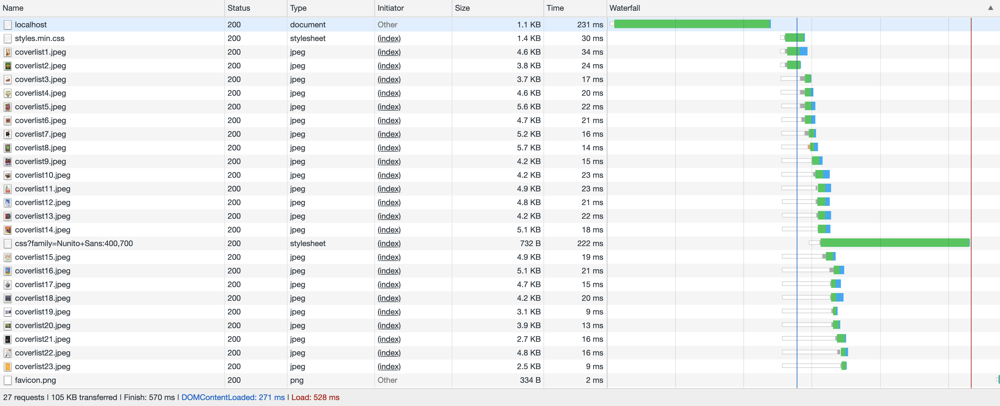
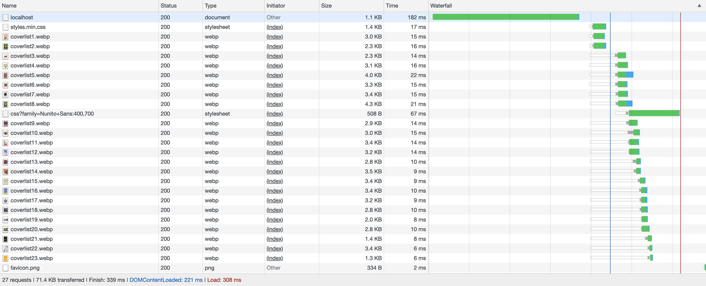
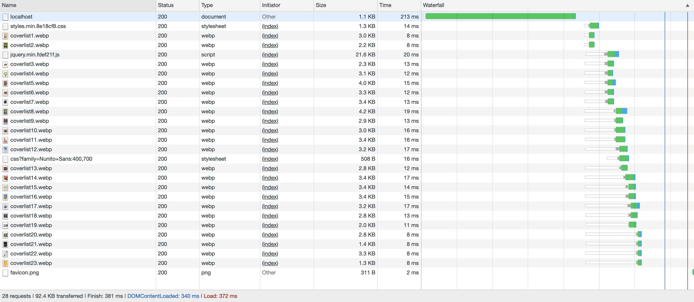

<h1 align="center">Performance Matters @cmda-minor-web · 2018-2019</h1>

<p align="center"><b>Coverting the <a href="https://github.com/Mennauu/project-1-1819" target="_blank">OBA client side web app</a> to a server side rendered application. Also, a series of optimisations have been implemented to improve the performance of the application. It also works offline.</b>
</p>

<br>

<p align="center">
  <a href="https://github.com/Mennauu/performance-matters-1819/tree/master/week1">
    
  </a>
  &nbsp;&nbsp;&nbsp;
  <a href="https://github.com/Mennauu/performance-matters-1819/tree/master/week2">
    
  </a>
  &nbsp;&nbsp;&nbsp;
  <a href="https://github.com/Mennauu/performance-matters-1819/tree/master/week3">
    
  </a>
  &nbsp;&nbsp;&nbsp;
  <a href="https://performance-matters--1819.herokuapp.com/">
    
  </a>
  &nbsp;&nbsp;&nbsp;
  <a href="https://github.com/Mennauu/web-app-from-scratch-18-19/blob/master/LICENSE">
    
  </a>
</p> 

<br>


<br>

<!-- ☝️ replace this description with a description of your own work -->
## Introduction
In this course we will convert the client side web application made earlier at the OBA to a server side rendered application. We are also going to implement a series of optimisations to improve the performance of the application. Ultimately we ensure that the application is available offline.

Some resources possess an emoticon to help you understand which type of content you may find:

- 📖: Documentation or article
- 🛠: Tool or library
- 📹: Video

<!-- Maybe a table of contents here? 📚 -->
## Table of Contents

- [Installation](#installation)
- [Interactions](#interactions)
- [Optimisations](#data)
  - [First view](#first-view)
    - [Minifying](#minifying)
    - [Compression](#compression)
    - [Images to WebP](#images-to-webp)
    - [Precompression](#precompression)
  - [Repeat view](#repeat-view)
    - [Caching](#caching)
  - [Results](#results)
  - [ServiceWorker](#serviceworker)
- [Checklist](#checklist)
- [Credits](#credits)
- [Sources](#sources)
- [License](#license)

<!-- How about a section that describes how to install this project? 🤓 -->
## Installation
1. Open your terminal
2. Change the directory to a folder in which you want to place the files
```bash
cd /~path
```
3. Clone the repository (you're going to need [Git](https://www.linode.com/docs/development/version-control/how-to-install-git-on-linux-mac-and-windows/))
```bash
git clone https://github.com/Mennauu/performance-matters-1819
```
4. Change directory to repository
```bash
cd performance-matters-1819
```
5. Install dependencies from [package.json](https://github.com/Mennauu/performance-matters-1819/blob/master/week2/package.json)
```bash
npm install
```
6. Run application with [Node](https://nodejs.org/en/)
```bash
node app.js
```

## Optimisations

### First view
___

#### Minifying
I minified CSS using [Clean CSS](https://www.npmjs.com/package/clean-css) and jQuery using an online tool called [JavaScript Minifer](https://javascript-minifier.com/).

```diff
+ CSS size reduction: 17,7%
+ JQUERY size reduction: 63.4%
```
<details>
  <summary>Network results based on a slow 3G network</summary>
<br>

**Not minified**
```
CSS: Size 1.7 KB | Time 2.25s
JQUERY: Size: 66.9 KB | Time 3.65s
```

**Minified**
```
Size: 1.4 KB | Time: 2.08s
jQUERY: 24.5 KB | Time 2.78s
```
</details>

___

#### Compression
I used [Compression](https://www.npmjs.com/package/compression) to compress files to GZIP. I used [Shrink Ray](https://www.npmjs.com/package/shrink-ray) to compress files to Brotli.

Brotli compression seems to be the most efficient.
```diff
+ HTML size reduction 71,4%
+ CSS size reduction: 54,8%
+ JQUERY size reduction: 72,9%
```
<details>
  <summary>Network results based on a slow 3G network</summary>
<br>

**Without compression**
```
HTML: Size 4.2 KB | Time 2.09s
CSS: Size 3.1 KB | Time 2.27s
JQUERY: Size 247 KB | Time 8.14s

28 requests | 1326 KB transferred | Finish 15.31s | DOMContentLoaded: 12.34s | Load 13.29s
```

**With Gzip (no jQuery)**
```
HTML: Size 1.2 KB | Time 2.01s
CSS: Size 1.4 KB | Time 2.04s

27 requests | 105 KB transferred | Finish 13.40s | DOMContentLoaded: 2.06s | Load 11.38s
```

**With Brotli**
```
HTML: Size 1.0 KB | Time 2.01s
CSS: Size 1.4 KB | Time 2.03s
JQUERY: Size: 66.9 KB | Time 3.65s

28 requests | 138 KB transferred | Finish 14.41s | DOMContentLoaded: 6.18s | Load 12.39s
```
</details>

___

#### Precompression
Precompression contained a lot of steps:

1. I used [Bread Compressor CLI](https://www.npmjs.com/package/bread-compressor-cli) to compress all minified JavaScript and CSS files to gzip and brotli.
2. I used [Gulp](https://www.npmjs.com/package/gulp) and [Gulp Rev](https://www.npmjs.com/package/gulp-rev) to give unique hash digits to all JavaScript, CSS, gzip and brotli files and create a manifest.
```javascript
gulp.src(['public/*.{css,js,br,gz}'])
  .pipe(rev())
  .pipe(gulp.dest('public/'))
  .pipe(rev.manifest('rev-manifest.json'))
  .pipe(gulp.dest('public/'))
```
3. I used [Gulp Rev Collector](https://www.npmjs.com/package/gulp-rev-collector) to collect data from the manifest and replace links in html (to hashed links)

```javascript
gulp.src(["public/rev-manifest.json", "views/layouts/default.hbs"])
  .pipe(revCollecter({ replaceReved: true }))
  .pipe(gulp.dest("views/layouts/"))
```
4. I used middleware to serve compressed files (credits to [Maikel](https://github.com/Maikxx))
<details>
  <summary>Expand to see code of middelware</summary>

```javascript
app.get(['*.js', '*.css'], (req, res, next) => {
  const encoding = req.headers['accept-encoding']
  const extensionIndex = req.originalUrl.lastIndexOf('.')
  const extension = req.originalUrl.slice(extensionIndex)

  if (encoding && encoding.includes('br')) {
    req.url = `${req.url}.br`
    res.set('Content-Encoding', 'br')
  } else if (encoding && encoding.includes('gzip')) {
    req.url = `${req.url}.gz`
    res.set('Content-Encoding', 'gzip')
  }

  res.set('Content-Type', extension === '.js' ? 'text/javascript' : 'text/css')
  next()
})
```
</details>


#### Images to WebP
Support is weak for WebP, but that doesn't mean we shouldn't use it in browsers that can actually make use of it. We can use a fallback. Browsers that don't support the picture tag, or webp files, will just ignore those lines and render the fallback image in the img tag.
```diff
+ Total images size reduction: 32%
```

```html
<picture>
  <source srcset="{{cover_image}}" type="image/webp">
  <source srcset="{{cover_image_fallback}}" type="image/jpeg">
  
</picture>
```

<details>
  <summary>Network results based on a slow 3G network</summary>
<br>

**Jpeg**



**WebP**



</details>

___

### Repeat view

#### Caching
**HTML files**
* Cache-Control: no-cache
* With Etag
* No X-Powered-By

**JavaScript, CSS, and image files** 
* Cache-Control: public, max-age=31536000
* No Etag, 
* No Last-Modified
* No X-Powered-By

### Results
<details>
  <summary>First view network results</summary>



</details>

<details>
  <summary>Repeat view network results</summary>


</details>

### ServiceWorker

1. We first register the ServiceWorker

```JavaScript
if ('serviceWorker' in navigator) {
  window.addEventListener('load', () => {
    navigator.serviceWorker
      .register('/sw.js')
      .then((registration) => registration.update)
  })
}
```

2. We set a name and add which files to cache

```JavaScript
const staticCacheName = 'oba-cache-v1'
const filesToCache = [
  '/',
  '/styles-60bf7a2ac9.min.css',
  '/main.js',
  '/jquery-fdef21f018.min.js',
  '/images/favicon.png',
  '/images/coverlist1.webp',
  '/Sprookjes',
  '/Sprookjes/=9789048719341'
]
```

3. We install the ServiceWorker
```JavaScript
self.addEventListener('install', (event) => {
  event.waitUntil(caches.open(staticCacheName)
    .then(cache => cache.addAll(filesToCache))
  )
})
```

4. We fetch data from the ServiceWorker
```JavaScript
self.addEventListener('fetch', (event) => {
  event.respondWith(caches.match(event.request)
    .then((response) => {
      return response || fetch(event.request)
    })
  )
})
```

5. Succes! You can now visit the website, offline 😄


<!-- Maybe a checklist of done stuff and stuff still on your wishlist? ✅ -->
## Checklist
- [x] Rebuild client side app to server side app
- [x] Add Handlebars
- [x] Minifiy files
- [x] Add unique hash digits to css and javascript files
- [x] Add (pre)compression
- [x] Set cache headers (for caching)
- [x] Implement a ServiceWorker
- [x] Make website work offline

<!-- Maybe someone helped me 🤔-->
## Credits

**[Maikel](https://github.com/Maikxx)**: for his middleware which serves precompressed files

<!-- Maybe I used some awesome sources that I can mention 🤔-->
## Sources
Underneath you will find all the sources that were previously mentioned throughout the document and some others which were helpful.

> * 🛠 [Clean CSS](https://www.npmjs.com/package/clean-css)
> * 🛠 [JavaScript Minifer](https://javascript-minifier.com/)
> * 🛠 [Compression](https://www.npmjs.com/package/compression)
> * 🛠 [Shrink Ray](https://www.npmjs.com/package/shrink-ray)
> * 🛠 [Bread Compressor CLI](https://www.npmjs.com/package/bread-compressor-cli)
> * 🛠 [Gulp](https://www.npmjs.com/package/gulp) 
> * 🛠 [Gulp Rev](https://www.npmjs.com/package/gulp-rev)
> * 🛠 [Gulp Rev Collector](https://www.npmjs.com/package/gulp-rev-collector)

> * 📖 [Mozzila: Picture element](https://developer.mozilla.org/en-US/docs/Web/HTML/Element/picture)
> * 📖 [WikiHow: Disable JavaScript](https://www.wikihow.com/Disable-JavaScript)
> * 📖 [Google: Caching files with Service Worker](https://developers.google.com/web/ilt/pwa/caching-files-with-service-worker)
> * 📖 [Captech: My Experience using serviceworkers](https://www.captechconsulting.com/blogs/my-experience-using-service-workers)
> * 📖 [Google: Adding a Service Worker and Offline](https://developers.google.com/web/fundamentals/codelabs/offline/)

<!-- How about a license here? 📜 (or is it a licence?) 🤷 -->
## License 
See the [LICENSE file](https://github.com/Mennauu/web-app-from-scratch-18-19/blob/master/LICENSE) for license rights and limitations (MIT).
