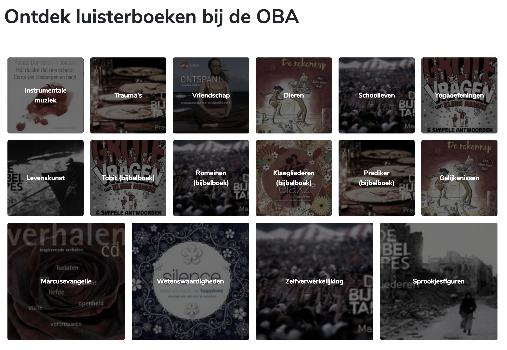

<h1 align="center">Performance Matters @cmda-minor-web · 2018-2019</h1>

<p align="center"><b>Transfering the <a href="https://github.com/Mennauu/project-1-1819" target="_blank">OBA client side web app</a> to a server side rendered application. Also, a series of optimisations have been implemented to improve the performance of the application. It's also avaiable offline.</b>
</p>

<br>

<p align="center">
  <a href="https://mennauu.github.io/web-app-from-scratch-18-19/week1">
    
  </a>
  &nbsp;&nbsp;&nbsp;
  <a href="https://mennauu.github.io/web-app-from-scratch-18-19/week2">
    
  </a>
  &nbsp;&nbsp;&nbsp;
  <a href="https://mennauu.github.io/web-app-from-scratch-18-19/week3">
    
  </a>
  &nbsp;&nbsp;&nbsp;
  <a href="https://github.com/Mennauu/web-app-from-scratch-18-19/blob/master/LICENSE">
    
  </a>
</p> 

<br>



<br>

<!-- ☝️ replace this description with a description of your own work -->
## Introduction
[ Description ]

Some resources possess an emoticon to help you understand which type of content you may find:

- 📖: Documentation or article
- 🛠: Tool or library
- 📹: Video

You can find a live demo right here: https://mennauu.github.io/performance-matters-1819/week3

<!-- Maybe a table of contents here? 📚 -->
## Table of Contents

- [Installation](#installation)
- [Interactions](#interactions)
- [Data](#data)
  - [Authentication and limit](#authentication-and-limit)
  - [Featured data](#featured-data)
  - [Retrieve](#retrieve)
  - [Cache](#cache)
- [Code structure](#code-structure)
  - [Actor diagram](#authentication-and-limit)
  - [Interaction diagram](#authentication-and-limit)
- [Checklist](#checklist)
- [Credits](#credits)
- [Sources](#sources)
  - [API](#api)
  - [Router](#router)
  - [Async and await](#async-and-await)
  - [General JavaScript](#general-javascript)
  - [Diagrams](#diagrams)
- [License](#license)

<!-- How about a section that describes how to install this project? 🤓 -->
## Installation
1. Open your terminal
2. Change the directory to a folder in which you want to place the files
```bash
cd /~path
```
3. Clone the repository (you're going to need [Git](https://www.linode.com/docs/development/version-control/how-to-install-git-on-linux-mac-and-windows/))
```bash
git clone https://github.com/Mennauu/performance-matters-1819
```
4. 

## Feature research
The goal is to research at least two features that are being used on websites and figure out what impact these features have on sites I, and you, know and use normally.

### JavaScript
Websites without JavaScript.

#### Problems
The biggest problem right now is that most modern websites use JavaScript as of today (11-03-2019). Websites are build in JavaScript frameworks, like react or vue. When this is the case, disabling JavaScript means that literally nothing is being shown; sometimes only an error message displaying "Enable JavaScript to use this website".

There is a portion of people that deliberately turned off JavaScript: [0.2% of pageviews from worldwide traffic across all devices in the fourt quarter 2016 had JavaScript disabled.](https://blockmetry.com/blog/javascript-disabled). When your website relies on JavaScript, this portion won't be able to use your website. 

JavaScript requires a stable internet connection to load properly. If your user has a poor internet connection, your website might take too long to load, making the user retreat from your website.

#### How to achieve
In all browsers you can turn off JavaScript in the browser settings. You can follow the steps, for your specific browser, on this page: [WikiHow: Disable JavaScript](https://www.wikihow.com/Disable-JavaScript) to turn off JavaScript.

#### Examples
The first website I wanted to try without JavaScript is a site I created myself: abc-legal.com. Turns out, the website works loads extremely fast without JavaScript and looks nearly identical. The two things that don't work are slideshows and the ability to change from language. We could solve those problems by showing a static image for the slideshow, and hard-linking the different languages options (these are being loaded dynamically by JavaScript, right now).

The second website I went to was ark.io. I know this website is made using Vue.JS, and guess what, nothing loads! You are left with a blank page. They don't even provide you with an error message.

The last website I decided to visit was smashingmagazine.com, because Vitaly (our previous teacher) was part of making it, and is all for using CSS over JavaScript - and is hyped about a great User Experience, for all users. Damn, this website is really, really good without JavaScript. Functionalities that need JavaScript to work are not being shown. The search bar is replaced with a Smashing Magazine Google Search - so you can still use the search functionality, without JavaScript. The only downside I could find is that images from the authors are not loaded. They are loaded through JavaScript.

### Broadband
Load websites by simulating a slow 3G network connection.

#### Problems
If the functionality from your website takes to long to load on a slow network connection, the user will retreat from your website.

#### How to achieve
You can achieve a slow network connection by opening your console and navigating to "Network". Once there you can click on "Online" with the arrow pointing down, and choose a preset, like 3G slow.

#### Examples
Once again I was very curious how fast smashingmagazine.com would load on a slow 3G network connection. It took 9 seconds to load everything, which is very fast! However, it loads everything at the same time, as if the entire page is loaded asynchronous. It could only show HTML first, and afterwards load CSS.

## Optimalisation
* Kijk naar NPM scripts
* Kijk naar gulp of nieuwere tools dan Gulp


HET BUILDEN VAN DE HELE APP VIA NPM


- Minification
- file revisioning (rev-manifest)
- Brotli ipv GZIP
- precompression (Static site)
- img revision tag (304 - 200)
- srcset and sizes attributes 
- Picture html tag (client hints) - webp met fallbacks
- Resource hints
- DNS-PREFETCH
- link preconnect, prefetch, preload, prerender
- font subsetting
- font rendering controls (font-display: swap)
- Reflow verminderen door op de fallback font line-height en letter-spacing te plaatsen (Font style Matcher)
- fontFaceObserver (add class async (after font is loaded)) with a cookie and class
- Defer, async scripts
- Je kan styles asynchroon inladen (LoadCSS)
- Critical CSS - minimum css nodig (lijn trekken)


<!-- What external data source is featured in your project and what are its properties 🌠 -->
## Data

### Featured data

### Retrieve

## Code structure
I created two diagrams to show the actors of my code (actor diagram), whom handle functionality in my app, and what happens in my code (interaction diagram).

> * 🛠 [Draw](https://draw.io)

### Actor diagram


### Interaction diagram


<!-- Maybe a checklist of done stuff and stuff still on your wishlist? ✅ -->
## Checklist
- [x] Filled
- [ ] Empty


<!-- Maybe someone helped me 🤔-->
## Credits

<!-- Maybe I used some awesome sources that I can mention 🤔-->
## Sources
Underneath you will find all the sources that were previously mentioned throughout the document and some others which were helpful.

<!-- How about a license here? 📜 (or is it a licence?) 🤷 -->
## License 
See the [LICENSE file](https://github.com/Mennauu/web-app-from-scratch-18-19/blob/master/LICENSE) for license rights and limitations (MIT).
